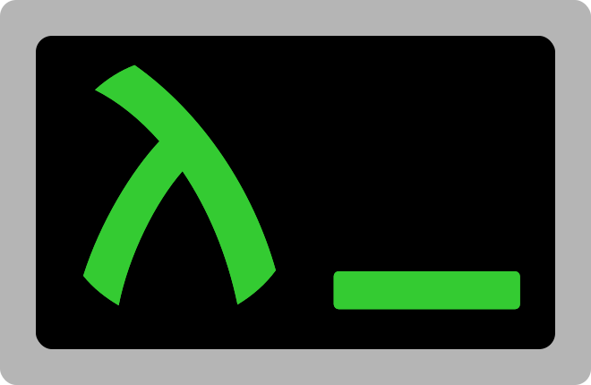

<h1 align="center">Rash: The Reckless Racket Shell</h1>

Rash is a shell language, library, and REPL for Racket.

Use as a repl that is as convenient for pipelining programs as Bash is, but has all the power of Racket.  Use as a scripting language with `#lang rash`.  Embed in normal Racket files with `(require rash)`, and mix freely with any other Racket language or library.

Rash is in active development, and is not stable as a language.  But I use it as my default interactive shell on my laptop.  It's far from complete, but I already like it much better than Bash.  Give it a try.

## Getting started

### Prerequisites

Rash does work on windows, but it works better and is more useful on unix based systems.

To install, you will need a working instalation of [racket](https://download.racket-lang.org/) v6.12.

### Installation
You can either install with racket's built in package manager, [`raco`](https://docs.racket-lang.org/raco/), or install directly from github.  If you have DrRacket installed, you can install rash with `File -> Install Package`.
#### via raco:
`raco pkg install rash`

#### git version:
`git clone https://github.com/willghatch/racket-rash rash && cd rash && raco pkg install`

### Usage

Online documentation is [here](http://docs.racket-lang.org/rash@rash/index.html).  After installation, local documentation can be accessed with `raco docs rash`.

I gave a talk about Rash at RacketCon 2017.  It's slightly out of date, but you can watch it  [here](https://www.youtube.com/watch?v=yXcwK3XNU3Y&index=13&list=PLXr4KViVC0qIgkwFFzM-0we_aoOfAl16Y).

And here's a quick demo video (also slightly out of date):

This repo also contains the [shell-pipeline](https://docs.racket-lang.org/shell-pipeline/index.html) and [linea](http://docs.racket-lang.org/linea/index.html) packages.  They mostly support Rash itself, so they live in the same repo.
